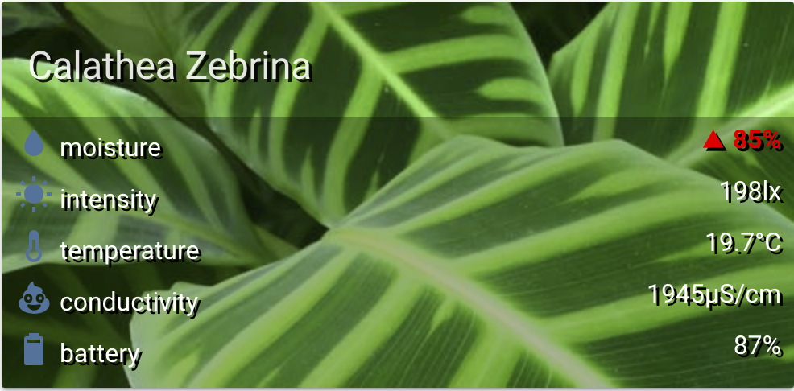

# Plant Card

A Home Assistant Lovelace card to report MiFlora plant sensors based on the HA Plant Card




## Options

| Name | Type | Default | Description
| ---- | ---- | ------- | -----------
| type | string | **Required** | `custom:plant-card`
| title | string | **Required** | Name of the plant being monitored
| image | string | **Required** | Path to an image of the plant being monitored
| min_moisture | integer | Optional | Minimum moisture content for this plant
| max_moisture | integer | Optional | Maximum moisture content for this plant
| min_conductivity | integer | Optional | Minimum conductivity reading for this plant
| min_temperature | integer | Optional | Minimum temperature for this plant
| entities | list | **Required** | A list sensors to be monitored


## Installation

1. Install the `plant-card` component by copying `plant-card.js` to `<config directory>/www/plant-card.js`


2. Link `plant-card` inside your `ui-lovelace.yaml`

```yaml
resources:
  - url: /local/plant-card.js
    type: js
```

3. Add a custom card in your `ui-lovelace.yaml`

```yaml
- type: custom:plant-card
  title: 'Calathea Zebrina'
  image: images/calathea-zebrina.jpg
  min_moisture: 15
  max_moisture: 60
  min_conductivity: 350
  min_temperature: 12
  entities:
  - moisture:sensor.plant_1_moisture
  - intensity:sensor.plant_1_light_intensity
  - temperature:sensor.plant_1_temperature
  - conductivity:sensor.plant_1_conductivity
  - battery:sensor.plant_1_battery

```
